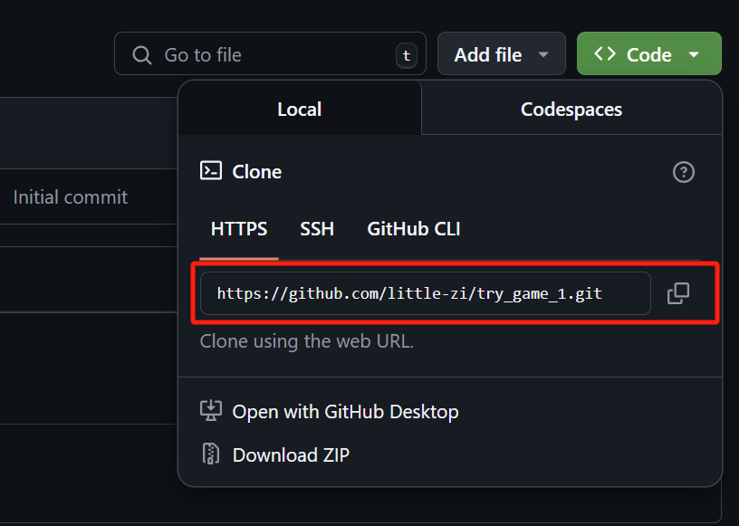

# 学习笔记

## 1. conda
### 1） 下载
国内到清华园镜像下载
国外不需要

### 2） 安装
- 不要安装到C盘，保持C盘的整洁，有助于系统的稳定运行

### 3） 使用
- 初始化：打开 `conda prompt`，输入命令：`conda init`，会添加`conda`的系统环境变量

- 修改系统powershell的执行策略：设置-系统-开发者选项-powershell-更改执行策略：打开  
这样的话就可以在windows的powershell里直接使用conda命令了
- 简单介绍一下用法：  
a. `conda --version` 查看安装版本  
b. `conda --help` 查看帮助文件。（大多数命令行工具都可以使用这个命令查看帮助文件，了解这些命令的基本使用方法）

## 2. git
### 1） 下载
国内同样用清华园

### 2） 安装
- 非系统盘
- 一般默认即可，选`recommended`的选项。如果使用`vscode`作为默认编辑器，需选择对应选项

### 3） 使用
- `git --version`
- `git --help`
- 需要先到`github`建立项目，然后使用`git clone`命令将项目克隆到本地

